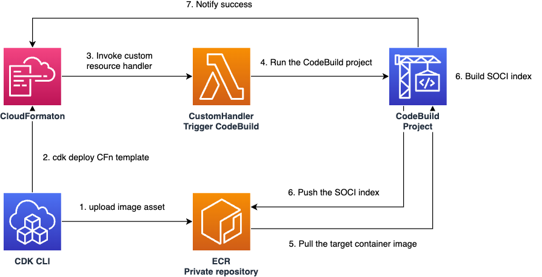

**TL;DR;**

You can build SOCI index and push it to ECR from CDK with this code:

```
npm install deploy-time-build
```

```typescript
import { SociIndexBuild } from "deploy-time-build";

const asset = new DockerImageAsset(this, "Image", {
  directory: "example-image",
});

SociIndexBuild.fromDockerImageAsset(this, "Index", asset);
```

## Introduction

Recently, [Seekable OCI (SOCI) became available for AWS Fargate](https://aws.amazon.com/jp/about-aws/whats-new/2022/09/introducing-seekable-oci-lazy-loading-container-images/), enabling faster startup times for ECS tasks.

According to this post, SOCI is particularly effective for larger images (25% speedup for 141MB images, 75% for 1GB images):

> I did a few quick experiments on SOCI support for Fargate / ECR, comparing the gains for different image sizes.
>
> — Apparent Order (@apparentorder) [July 18, 2023](https://x.com/apparentorder/status/1681321222225928193)

To use this feature, you need to build a SOCI index for your container image and push it to the same ECR repository. There are primarily two methods available, each with their own characteristics:

1. Using the [soci-snapshotter CLI](https://github.com/awslabs/soci-snapshotter)
   - ✅ Simple CLI interface that's easy to integrate with other pipelines
   - ❌ Linux-only support, requires containerd, and has specific execution environment requirements
2. Using the [cfn-ecr-aws-soci-index-builder solution](https://aws-ia.github.io/cfn-ecr-aws-soci-index-builder/)
   - ✅ Can be set up with a single CloudFormation template
   - ❌ Index is pushed asynchronously, so it might not be available when your task executes
   - ❌ Index is built on Lambda, limiting the container image size you can work with

Both options are somewhat cumbersome, which is why many developers might have seen benchmark results and decided it's not worth the trouble to implement.

In AWS CDK, there's a convention to [build container images during CDK deployment](https://docs.aws.amazon.com/cdk/api/v2/docs/aws-cdk-lib.aws_ecr_assets.DockerImageAsset.html). It would be convenient to deploy SOCI indexes from CDK in a similar way. This article explains how I created a solution for this and how to use it.

## What I Built

I developed a construct library called `deploy-time-build` that allows you to build and push SOCI indexes during CDK deployment.

[github.com](https://github.com/tmokmss/deploy-time-build)

## How to Use It

By specifying an image tag and ECR repository, you can build an index for the image and push it to the same repository.

Here's an example that adds an index to an image with the tag `someTag` in an ECR repository named `someRepository`:

```typescript
import { Repository } from "aws-cdk-lib/aws-ecr";
import { SociIndexBuild } from "deploy-time-build";

new SociIndexBuild(this, "Index", {
  imageTag: "someTag",
  repository: Repository.fromRepositoryName(this, "Repo", "someRepository"),
});
```

In practice, you'll often want to add an index to a CDK `DockerImageAsset`. This is also easy to write. The following example builds the Dockerfile in the `example-image` directory and adds an index to that image:

```typescript
import { DockerImageAsset } from "aws-cdk-lib/aws-ecr-assets";

const asset = new DockerImageAsset(this, "Image", {
  directory: "example-image",
});
SociIndexBuild.fromDockerImageAsset(this, "Index", asset);
```

When referencing container images from the CDK ECS module, you'll often use the `AssetImage` class. In that case, you can create an `AssetImage` from a previously defined `DockerImageAsset`:

```typescript
import { AssetImage } from "aws-cdk-lib/aws-ecs";
const assetImage = AssetImage.fromDockerImageAsset(asset);
```

You might not want to deploy your ECS service when the SOCI index hasn't been pushed yet. In that case, you can set up a dependency relationship for the ECS service resource:

```typescript
import { FargateService } from "aws-cdk-lib/aws-ecs";
const service = new FargateService();
const index = SociIndexBuild.fromDockerImageAsset();

service.node.defaultChild!.node.addDependency(index);
```

Python CDK users can use it similarly:

```python
pip install deploy-time-build

from deploy_time_build import SociIndexBuild

asset = DockerImageAsset(self, "Image", directory="example-image")
SociIndexBuild(self, "Index", image_tag=asset.asset_hash, repository=asset.repository)
SociIndexBuild.from_docker_image_asset(self, "Index2", asset)
```

These are the basic usage patterns. If you're interested in how it works, read on.

## How It Works

During CDK deployment, a CodeBuild project job is started, which builds and pushes the index within that job.



To build the SOCI index on CodeBuild, I wanted a standalone tool, so I created and used a CLI called [soci-wrapper](https://github.com/tmokmss/soci-wrapper). It repurposes code from the cfn-ecr-aws-soci-index-builder introduced earlier, so the output is identical.
This issue provides more context about the CLI background: [Ability to run soci create command in CodeBuild #760](https://github.com/awslabs/soci-snapshotter/issues/760)

Ideally, this functionality would be integrated into the CDK CLI (since container image building itself is done locally). However, considering that soci-snapshotter currently only runs on Linux, it's challenging for the CDK CLI, which needs to work similarly across Linux/Windows/Mac. I've at least created an issue for it: [core: push SOCI index when publishing docker image assets #26413](https://github.com/aws/aws-cdk/issues/26413)

## Summary

I've introduced a CDK construct library to easily deploy SOCI indexes from AWS CDK.

SOCI indexes were discussed at yesterday's JAWS container branch meeting, which motivated me to finish this article that I had started six months ago. Thank you!

> Here are today's materials <https://t.co/hFDDmTRP89>[#jawsug_ct](https://twitter.com/hashtag/jawsug_ct?src=hash&ref_src=twsrc%5Etfw)
>
> — takahash (@\_takahash) [March 7, 2024](https://twitter.com/_takahash/status/1765693886956220593?ref_src=twsrc%5Etfw)
