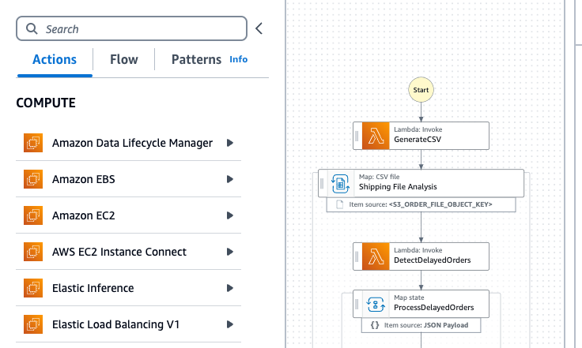
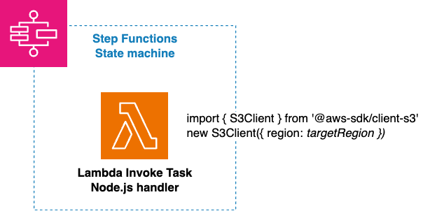
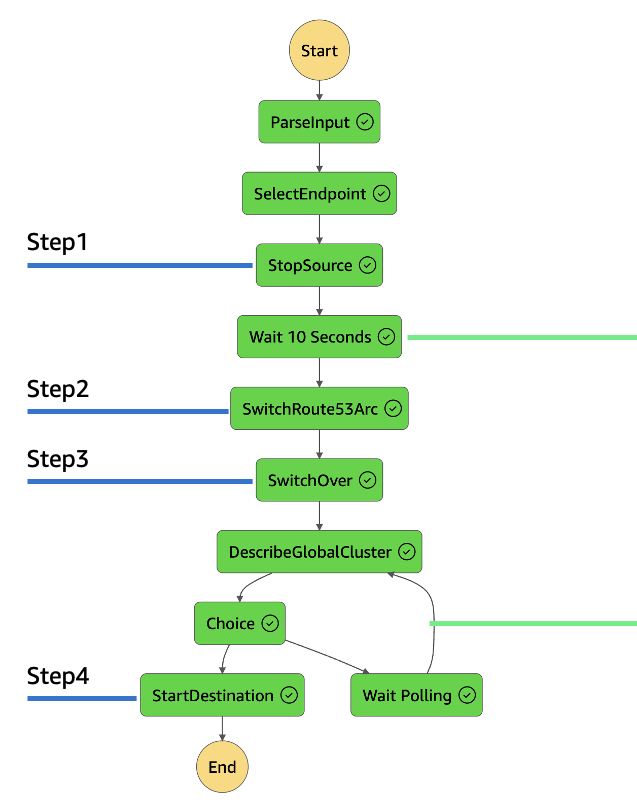
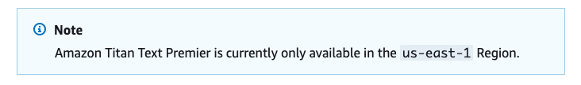

This is an article in the [AWS CDK Tips series](https://tmokmss.hatenablog.com/entry/aws_cdk_tips).

Recently, I had a new feature merged into AWS CDK, so I'd like to introduce it. It's a construct for calling AWS APIs from Step Functions in a different region.

[github.com](https://github.com/aws/aws-cdk/pull/30061)

## TL;DR

With the following code, you can implement a Step Functions task to call cross-region AWS APIs (available from CDK v2.148.0):

```typescript
const getObject = new tasks.CallAwsServiceCrossRegion(this, "GetObject", {
  region: "us-west-2",
  service: "s3",
  action: "getObject",
  parameters: {
    Bucket: myBucket.bucketName,
    Key: sfn.JsonPath.stringAt("$.key"),
  },
  iamResources: [myBucket.arnForObjects("*")],
});
```

Documentation can be found here: [aws-cdk-lib.aws_stepfunctions_tasks module · AWS CDK](https://docs.aws.amazon.com/cdk/api/v2/docs/aws-cdk-lib.aws_stepfunctions_tasks-readme.html#cross-region-aws-api-call)

## Motivation

AWS Step Functions provides functionality to call AWS APIs within state machines: [AWS SDK Integrations](https://docs.aws.amazon.com/step-functions/latest/dg/supported-services-awssdk.html)



However, this feature only allows calling AWS APIs in the same region as the state machine.

> Currently, cross-Region AWS SDK integration and cross-Region AWS resource access aren't available in Step Functions.
> <https://docs.aws.amazon.com/step-functions/latest/dg/concepts-access-cross-acct-resources.html>

You'd like to call AWS APIs across regions too, right? That's what this feature enables.

## How to Use It

If you've used Step Functions with AWS CDK before, it's simple. You've likely used the [`CallAwsService` construct](https://docs.aws.amazon.com/cdk/api/v2/docs/aws-cdk-lib.aws_stepfunctions_tasks.CallAwsService.html) to define AWS SDK integration functionality.

For cross-region cases, you can now use the [`CallAwsServiceCrossRegion` construct](https://docs.aws.amazon.com/cdk/api/v2/docs/aws-cdk-lib.aws_stepfunctions_tasks.CallAwsServiceCrossRegion.html).

Its usage is almost the same as the existing `CallAwsService` construct, but with an additional `region` property that specifies which region's AWS API to call.

Here's a code example:

```typescript
import * as sfn from "aws-cdk-lib/aws-stepfunctions";
import * as tasks from "aws-cdk-lib/aws-stepfunctions-tasks";

declare const table: ITable;

const deleteTable = new tasks.CallAwsServiceCrossRegion(this, "DeleteTable", {
  service: "dynamodb",
  action: "deleteTable",
  parameters: {
    TableName: table.tableName,
  },
  iamResources: [table.tableArn],

  region: "us-east-2",
});

new sfn.StateMachine(this, "StateMachine", {
  definition: deleteTable,
});
```

Note that the `CallAwsServiceCrossRegion` construct's properties aren't fully compatible with the `CallAwsService` construct. The `service` and `parameters` must be specified in AWS SDK for JavaScript v3 style, so please refer to the [API reference](https://docs.aws.amazon.com/AWSJavaScriptSDK/v3/latest/) as needed. Also note that this is only available in CDK v2.148.0 and later.

## How It Works

The mechanism is very simple - it uses a Lambda function (Node.js runtime) to call AWS APIs. By specifying the [region property](https://docs.aws.amazon.com/sdk-for-javascript/v3/developer-guide/setting-region.html#setting-region-constructor) during SDK initialization, it can call APIs in any region.



From the Step Functions input, the Lambda dynamically selects the necessary AWS SDK service and its method, then calls it with arguments.

While it's not difficult to develop similar functionality yourself, managing Lambda code on your own can be cumbersome. By using this construct, you can delegate various responsibilities to aws-cdk-lib, and users only need to keep their CDK version up to date.

## Use Cases

Here are some use cases for this feature.

### Cross-Region for Resilience

Cross-region AWS service usage was once a niche area only advanced users ventured into [citation needed]. For example, [BLEA FSI](https://github.com/aws-samples/baseline-environment-on-aws-for-financial-services-institute) proposes achieving high resilience through cross-region configuration, primarily for the financial industry.

[aws.amazon.com](https://aws.amazon.com/jp/blogs/news/bleafsi-update-v1-3-0/)

In the implementation sample above, Step Functions are used to automate cross-region failover. This required cross-region API calls (such as modifying parameters in each region). This mechanism is also useful for calling [Route53 Application Recovery Controller](https://docs.aws.amazon.com/routing-control/latest/APIReference/API_UpdateRoutingControlState.html), which requires specifying redundant endpoints for API calls\*¹.



\*¹ You need to call one of the endpoints distributed across multiple regions. I think this is a very unique service within AWS.

### Cross-Region for Bedrock

Today, cross-region design is not limited to resilience contexts. Particularly with Amazon Bedrock, US regions tend to be favored in terms of feature additions and [quotas](https://docs.aws.amazon.com/bedrock/latest/userguide/quotas.html), making cross-region implementations increasingly common. (For example: main application in Tokyo, Bedrock-related components in Oregon)



For instance, in [bedrock-claude-chat](https://github.com/aws-samples/bedrock-claude-chat), this feature is [used](https://github.com/aws-samples/bedrock-claude-chat/blob/82a6912e87bb0a7ae81268e0cceb1399b557e5d1/cdk/lib/constructs/embedding.ts#L479-L524) to initiate data ingestion from a Tokyo state machine to a Bedrock Knowledge Base in Oregon.

There may be other unexpectedly common applications. If you find one, please make use of this feature.

## Summary

I've introduced how to easily implement cross-region AWS API calls in Step Functions using AWS CDK.
Since code management can be considered the responsibility of aws-cdk-lib, the operational burden is relatively light even though it uses Lambda.
If you have a use case, please give it a try.

## This Month's Mona

Here's Mona, who values her personal space.


I'd love to nestle in that parting line of feathers on her belly.
