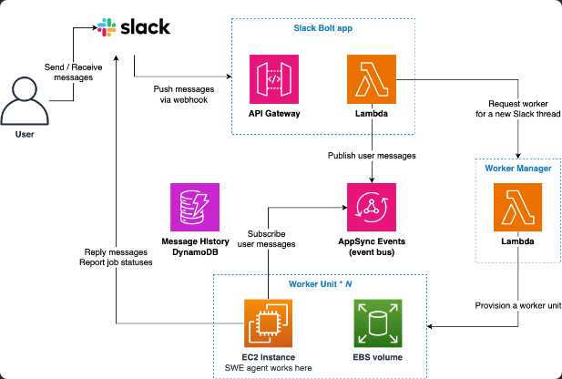
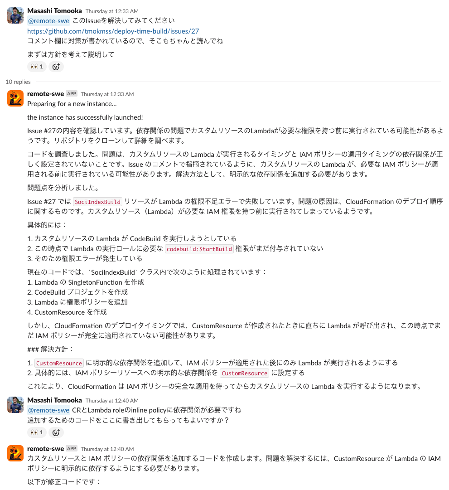
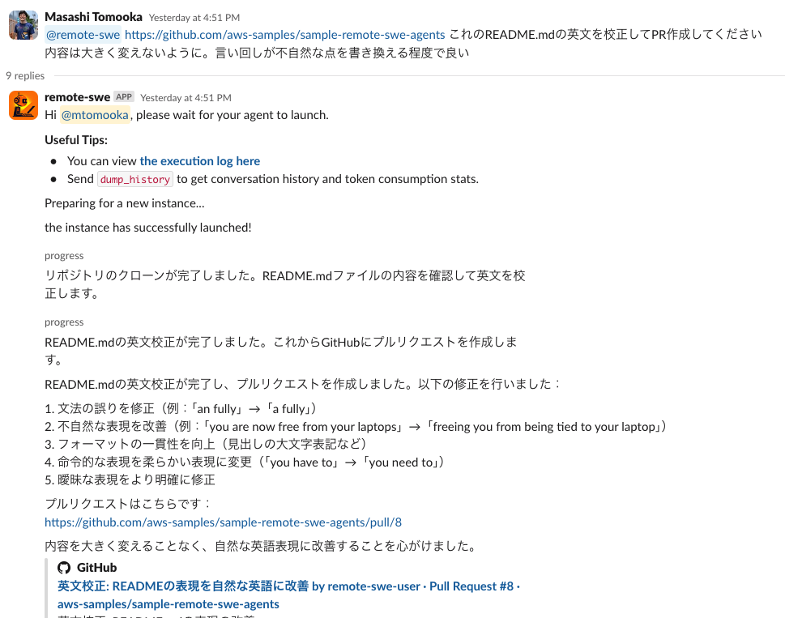
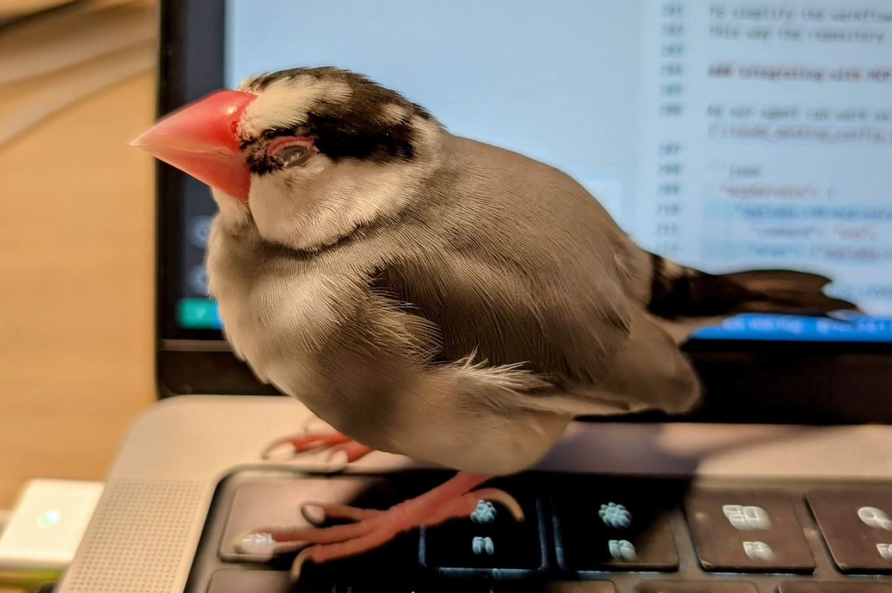

The collaborative AI teammate for software development, [Devin](https://devin.ai/), has been attracting a lot of attention. [Study sessions in the Japanese community](https://findy.connpass.com/event/344270/) have exceeded 1,000 participants! In this article, I'll introduce a self-hosted solution that achieves Devin-like functionality that I've developed.

## TL;DR;

I've released the source code (IaC + Agent + Bolt app) here:

[github.com - aws-samples/remote-swe-agents: Autonomous SWE agent working in the cloud!](https://github.com/aws-samples/remote-swe-agents)

Key features include:

- Software development agents that can run in parallel in the cloud
- Serverless architecture, no upfront fees and virtually zero fixed costs
- Integration with MCP server
- Cost optimization through prompt caching and context length control
- Ability to fork and develop OSS repositories
- Automatic loading of repository-specific knowledge from `.clinerules` and `CLAUDE.md`

Anyone with an AWS account, GitHub account, and Slack workspace can use it, so please give it a try!

## Background

I created this for three main reasons:

**Curiosity**: I wanted to create my own AI development agent, and realized there wasn't yet an open-source Devin-like solution. This boosted my motivation. (OpenHands, formerly OpenDevin, is designed for local operation, which made it feel less Devin-like than I expected.)

**Personal Use**: I was fortunate enough to try Devin and was impressed, but its price of $500 USD/month prepaid is quite steep for individual use. Running it on AWS allows me to utilize company accounts, which is convenient.

**AWS Service Demo**: When thinking about the architecture for this system, I realized it would be a good fit for [AWS AppSync Events](https://docs.aws.amazon.com/appsync/latest/eventapi/event-api-welcome.html), a managed Pub/Sub service that became GA last year. Creating an architecture incorporating this could help promote the service.

With these motivations, I managed to bring it to a releasable level! I've been dogfooding this agent during its own development, and thanks to the intelligence of Sonnet 3.7, it sometimes creates Pull requests that surprise me with their quality.

## Architecture

Here's what the AWS architecture looks like:

It's essentially a serverless architecture with zero fixed costs. A Slack Bolt app running on APIGW+Lambda receives user messages and, when necessary, launches EC2 instances where the agents operate. Each agent has its own dedicated instance, so work environments are completely isolated.

To pass messages from the Bolt Lambda to EC2, I'm using AppSync Events. With [Amplify libraries](https://docs.amplify.aws/react/build-a-backend/data/connect-event-api/), implementing the subscriber side becomes very straightforward, and unlike APIGW WebSockets, there's no need to manage connection IDs. I plan to write about these advantages in a separate article.

Some might wonder, "Why EC2?" Other options include ECS Fargate and CodeBuild. However, Fargate doesn't support Docker in Docker (which is inconvenient for development environments that use docker compose), and CodeBuild makes it difficult to persist file systems with EBS (which is necessary to maintain the previous work state when pausing and resuming an instance). These drawbacks led me to choose EC2. For our use case, instances are typically deleted after one day of activation, so EC2's disadvantages aren't particularly apparent. One issue is the slow startup due to initialization processes being executed via user data each time, but we plan to improve this with AMIs.

Infrastructure costs are [summarized in the README](https://github.com/aws-samples/sample-remote-swe-agents?tab=readme-ov-file#cost). Basically, costs are proportional to the number of sessions used (where one Slack thread counts as one session), and if you don't use it, the cost is virtually zero. While LLM usage dominates the total cost, [prompt caching is now available on Bedrock](https://docs.aws.amazon.com/bedrock/latest/userguide/prompt-caching.html), making the price competitive with other solutions in my experience.

## How to Use

It's not quite a one-click setup with CDK (due to Slack and GitHub integrations), but I've tried to make it as simple as possible. Please give it a try!

Setup instructions are in the [README.md](https://github.com/aws-samples/sample-remote-swe-agents?tab=readme-ov-file#installation-steps).

For those who just want to try it out, I recommend the following setup:

- Use a personal Slack workspace
  - If using a shared workspace, it's recommended to use the [ADMIN_USER_ID_LIST environment variable](https://github.com/aws-samples/sample-remote-swe-agents?tab=readme-ov-file#optional-restrict-access-to-the-system-from-the-slack) for access control
- Use PAT for GitHub authentication
  - GitHub App setup is a bit complicated, so PAT is recommended for initial use. However, if sharing with others, creating a machine user might be better (for access control and to avoid ambiguity in PR authorship). Currently, the system is designed for single-tenant use, so there isn't much benefit to using GitHub Apps (beyond not needing a machine user).

Setup should take about 20 minutes. For more detailed usage instructions, please refer to the README.md. There are many features not documented, so if you have questions, please [open an Issue](https://github.com/aws-samples/sample-remote-swe-agents/issues)!

## Impressions from Building It

Here are some thoughts from the development process:

### 1. Agent Performance

Agent performance (particularly task execution capability) is the most critical metric for practical use of this system. I've been focusing on this since February, and performance has improved dramatically since Bedrock started supporting Sonnet 3.7 and Reasoning. According to [Anthropic's blog](https://www.anthropic.com/news/claude-3-7-sonnet), it achieves 62% on [SWE Bench](https://www.swebench.com/#verified), placing it quite high on the coding ability leaderboard.

As a result, despite being a less sophisticated implementation compared to something like [OpenHands](https://arxiv.org/abs/2407.16741), it demonstrates respectable task execution capabilities in my experience. If agent performance is largely determined by the LLM type, future competition may center on UX and cost efficiency.

As of March 2025, most tools use Sonnet 3.7 ([Amazon Q CLI](https://aws.amazon.com/jp/about-aws/whats-new/2025/03/amazon-q-developer-cli-agent-command-line/), [Claude Code](https://docs.anthropic.com/en/docs/agents-and-tools/claude-code/overview), [Devin](https://docs.devin.ai/release-notes/overview#february-26%2C-2025)), which reinforces this point.

### 2. AI Utilization in Development Tasks

When using previous development agent tools, they often weren't very capable, and I frequently felt it was faster to do things myself. However, since the arrival of Sonnet 3.7, while it's not quite at the level of "always delivering code that exceeds a high passing grade," it's getting close. This makes me more motivated to use these tools.

That said, there are still many uncertainties when delegating ambiguous tasks, so I typically use the following approach:

1. Create a GitHub Issue with clear requirements and specifications. Explicitly indicate which files to examine and relevant file paths. Provide all knowledge necessary for completing the task.
2. Give the GitHub link to the agent and let it work until the PR CI passes.

Regarding the first point, while it would be ideal for the agent to handle vague instructions well, in reality it often performs misaligned work, and recovery becomes more costly in terms of time and fees. So I provide all necessary information upfront. Even so, it saves me from reading documentation details and implementing test code, making things easier.

### 3. The Appeal of Cloud-Based Agents

Personally, I prefer cloud-based agents like Devin over locally-running agents. This is subjective, of course. I tend to work in a more scattered way rather than concentrating intensely for short periods, so I like being able to quickly create Issues on my computer and then delegate tasks via Slack, monitoring and providing feedback from my phone.

Additionally, cloud-based agents make parallelization easy. Ideally, development agents could save time as illustrated below:

However, many tasks still don't complete in one pass, so the situation below is also realistic (where there's little difference from doing everything yourself!):

From my experience so far, the odds of getting good results by carelessly delegating tasks are not high (this is true even with Devin), so I think we should aim for something closer to the ideal scenario above (though not everything will be green). I personally believe in "writing is thinking," so I have a bias toward thinking that I can't organize my thoughts without writing.

That said, local agents (like Cline) and cloud-based agents aren't mutually exclusive, so I'd like to find a good balance between them! I'm currently using [Amazon Q Developer](https://marketplace.visualstudio.com/items?itemName=AmazonWebServices.amazon-q-vscode) 🥳

## Summary

So that was my experience creating a Devin-like cloud-based autonomous development agent! I gained many more technical insights that I hope to share elsewhere!

