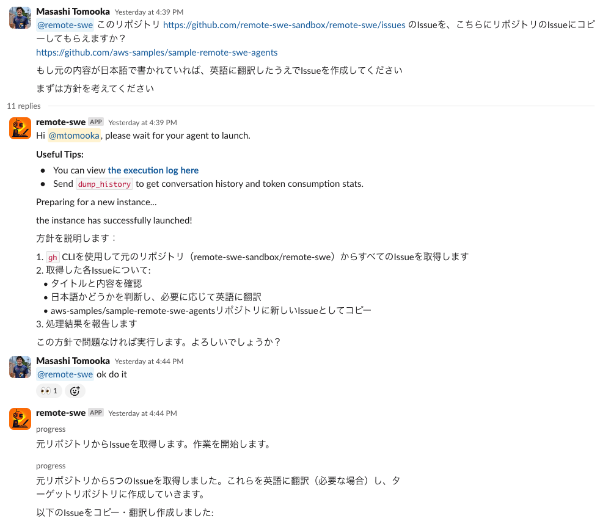

The software development agent Devin, which bills itself as a collaborative AI teammate, has been getting a lot of attention lately. A [study session in the Japanese community](https://findy.connpass.com/event/344270/) had over 1,000 participants (!) In this post, I'll introduce a self-hosted solution I've developed that achieves Devin-like functionality.

## TL;DR;

I've published the source code (IaC + Agent + Bolt app) here:

https://github.com/aws-samples/remote-swe-agents

Key features include:

- Software development agents that can work in parallel in the cloud
- Serverless architecture with no upfront costs and almost zero fixed costs
- Integration with MCP server
- Cost efficiency through prompt caching and context length control
- Ability to fork and develop OSS repositories
- Automatic loading of repository-specific knowledge from `.clinerules` and `CLAUDE.md` files

Anyone with an AWS account, GitHub account, and Slack workspace can use it, so give it a try!

## Development Background

There were three main reasons for creating this:

**Curiosity**: I wanted to create my own AI development agent, and realizing that there wasn't an open-source version of something like Devin yet motivated me. (The former OpenDevin, now OpenHands, is designed for local operation, so it didn't feel much like Devin to me.)

**Personal use**: I was introduced to Devin and was fascinated, but at $500 USD/month prepaid, it's quite expensive for individual use. Being able to run it on AWS makes it convenient to use with company accounts.

**As an AWS service demo**: When considering the architecture for this system, it seemed well-suited to [AWS AppSync Events](https://docs.aws.amazon.com/appsync/latest/eventapi/event-api-welcome.html), a managed Pub/Sub service that became GA last year. I figured an architecture incorporating this could help promote it.

With these motivations, I was able to bring it to a releasable level! I've been dogfooding this agent during its own development, and with Sonnet 3.7 being so smart, it sometimes creates surprisingly good Pull Requests.

## Architecture

Here's what the AWS architecture looks like:

It's basically a zero fixed-cost serverless configuration. A Slack Bolt app running on APIGW+Lambda receives user messages and starts up EC2 instances as needed, with the agent running inside the instance. Each agent has a dedicated instance, so the work environments are completely isolated.

For passing messages from the Bolt Lambda to EC2, I'm using AppSync Events. AppSync Events with [Amplify libraries](https://docs.amplify.aws/react/build-a-backend/data/connect-event-api/) makes the subscriber-side implementation very easy and eliminates the need for connection ID management like with APIGW WebSocket. I'll write more about these benefits in another article.

You might wonder, "Why EC2?" Other options could include ECS Fargate or CodeBuild. However, Fargate can't do Docker in Docker (which is inconvenient for development environments that need docker compose), and CodeBuild makes EBS file system persistence difficult (which is needed to preserve the previous work state when pausing and resuming an instance). These are the reasons I chose EC2. For this use case, instances are typically deleted after a day of operation, so EC2's downsides aren't very noticeable. One issue is that initialization is slow because user data is executed each time, but we plan to improve this with AMIs.

Infrastructure costs are [summarized in the README](https://github.com/aws-samples/sample-remote-swe-agents?tab=readme-ov-file#cost). Basically, costs are proportional to the number of sessions used (counting one Slack thread as one session), and if you don't use it, the cost is almost zero. LLMs dominate the total cost, but since [prompt caching is now available in Bedrock](https://docs.aws.amazon.com/bedrock/latest/userguide/prompt-caching.html), the price is competitive with other solutions (at least in my experience).

## How to Use It

It's not quite one-click deployment with CDK (due to Slack and GitHub involvement), but I've tried to make it as easy as possible, so please give it a try!

The steps are detailed in the [README.md](https://github.com/aws-samples/sample-remote-swe-agents?tab=readme-ov-file#installation-steps).

For those who just want to try it out, here's the recommended setup:

- Use a personal Slack workspace
  - If using a shared workspace, it's recommended to control access with the [ADMIN_USER_ID_LIST environment variable](https://github.com/aws-samples/sample-remote-swe-agents?tab=readme-ov-file#optional-restrict-access-to-the-system-from-the-slack)
- Use PAT for GitHub authentication
  - GitHub App setup is somewhat complicated, so PAT is recommended for beginners. However, if sharing with others, a machine user might be better (for access control and to avoid ambiguity in PR creation). Currently, the system is designed for single-tenant use, so there isn't much benefit to using GitHub App (except not needing a machine user).

It should take about 20 minutes to set up. For other detailed usage instructions, please refer to the README.md. There are many features not documented, so if you have any questions, please [open an Issue](https://github.com/aws-samples/sample-remote-swe-agents/issues)!

## Reflections on the Project

Here are some thoughts from the development process:

### 1. On Agent Performance

Agent performance (especially task execution capability) is the most important metric for making this system practical. I've been working hard on this since February, and after Bedrock added support for Sonnet 3.7 and Reasoning, performance improved dramatically. According to the [Anthropic blog](https://www.anthropic.com/news/claude-3-7-sonnet), it achieves 62% on [SWE Bench](https://www.swebench.com/#verified), putting it quite high on the coding capabilities leaderboard.

As a result, despite the implementation being less sophisticated compared to [OpenHands](https://arxiv.org/abs/2407.16741), it shows decent task performance in my experience. If agent performance is largely determined by the type of LLM, then UX and cost efficiency might become the competitive factors going forward.

As of March 2025, most tools are using Sonnet 3.7 ([Amazon Q CLI](https://aws.amazon.com/jp/about-aws/whats-new/2025/03/amazon-q-developer-cli-agent-command-line/), [Claude Code](https://docs.anthropic.com/en/docs/agents-and-tools/claude-code/overview), [Devin](https://docs.devin.ai/release-notes/overview#february-26%2C-2025)), which supports this theory.

### 2. On AI Use in Development Tasks

When using previous development agent tools, they weren't very capable, and it often felt faster to do things myself. However, since the emergence of Sonnet 3.7, while it's not quite at the level of "always producing high-quality code that exceeds passing grade," it's getting close. At this point, there's motivation to use it.

That said, I still find it risky to completely delegate ambiguous tasks, so I typically use it in the following way:

1. Create a GitHub Issue with clear requirements and specifications. Explicitly state which files to look at and provide the paths to relevant files. The idea is to provide all the knowledge needed for task completion.
2. Give the GitHub link to the agent and let it work until the PR's CI passes.

Regarding point 1, while it would be ideal if it could handle ambiguous instructions well, in reality it often does misaligned work, and recovery is more costly in terms of time and money. So I try to provide all necessary information upfront. Still, it saves the effort of reading detailed documentation and implementing tests, which makes things easier.

### 3. The Appeal of Cloud-based Agents

Personally, I prefer cloud-based agents like Devin over locally running ones. This is probably a matter of personal preference. I tend to work in a more scattered way rather than concentrating intensely for short periods, so I like being able to quickly create Issues on my computer and then delegate tasks via Slack, monitoring and providing feedback from my phone.

Furthermore, the appeal of cloud-based agents is that agent parallelization is easy. This means that if development agents could be used ideally, time savings like the diagram below could be realized.

However, many tasks don't finish in one pass, so situations like the one below are also realistic (the pattern where there's little difference if you just do everything yourself!):

From my experience so far, the odds of getting good results by casually delegating tasks aren't high (this is true for Devin too), so I think the ideal form above is what we should aim for in the near term (not everything will be green). I also personally believe in "writing is thinking," so I have the impression that I can't organize my thoughts without writing.

That said, local (like Cline) and cloud-based agents aren't mutually exclusive, so I'm looking to find a good way to use both! I'm currently using [Amazon Q Developer](https://marketplace.visualstudio.com/items?itemName=AmazonWebServices.amazon-q-vscode) 🥳

## Summary

So that's the story of creating a Devin-like cloud-based autonomous development agent! I've gained many other technical insights, which I hope to share in another forum!

Here's Mona-chan, looking sleepy after her Nth egg-laying and molting.

