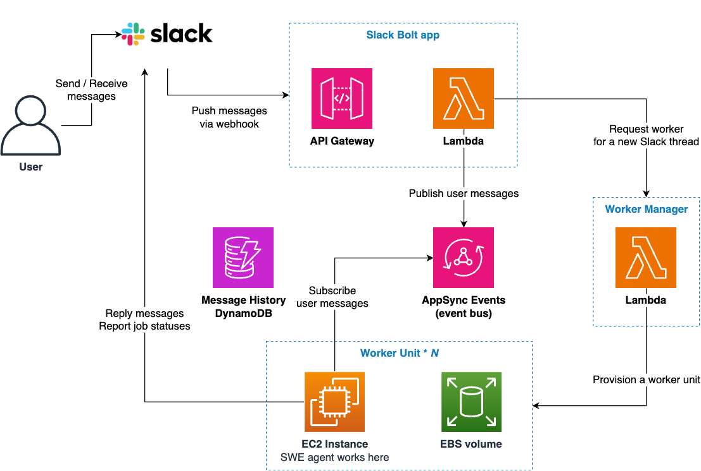

The collaborative AI teammate for software development, [Devin](https://devin.ai/), has been attracting a lot of attention. [Study sessions in the Japanese community](https://findy.connpass.com/event/344270/) have exceeded 1,000 participants! In this article, I'll introduce a self-hosted solution that achieves Devin-like functionality that I've developed.

## What is this?

I've released the source code (IaC + Agent + Slack Bolt app) for Remote SWE Agents:

[aws-samples/remote-swe-agents: Autonomous SWE agent working in the cloud!](https://github.com/aws-samples/remote-swe-agents)

Remote SWE Agents is a self-hosted solution that provides (Devin | OpenAI Codex)-like functionality with the following key features:

- Software development agents that can run in parallel in the cloud
- Serverless architecture, no upfront fees and virtually zero fixed costs
- Integration with MCP server
- Cost optimization through prompt caching and context length control
- Ability to fork and develop OSS repositories
- Automatic loading of repository-specific knowledge from `.clinerules` and `CLAUDE.md`

Here's what the AWS architecture looks like:

It's essentially a serverless architecture with zero fixed costs. A Slack Bolt app running on APIGW+Lambda receives user messages and, when necessary, launches EC2 instances where the agents operate. Each agent has its own dedicated instance, so development environments are completely isolated.

To pass messages from the Bolt Lambda to EC2, I'm using AppSync Events. With [Amplify libraries](https://docs.amplify.aws/react/build-a-backend/data/connect-event-api/), implementing the subscriber side becomes very straightforward, and unlike APIGW WebSockets, there's no need to manage connection IDs.

Why EC2? Other options include ECS Fargate and CodeBuild. However, Fargate doesn't support Docker in Docker (which is inconvenient for development environments that use docker compose), and CodeBuild makes it difficult to persist file systems with EBS (which is necessary to maintain the previous work state when pausing and resuming an instance). For our use case, instances are typically deleted after one day of activation.

## Why made this?

I created this for three main reasons:

**Curiosity**: I wanted to create my own AI development agent, and realized there wasn't yet an open-source Devin-like solution. This boosted my motivation. (OpenHands, formerly OpenDevin, is designed for local operation, which made it feel less Devin-like than I expected.)

**Personal Use**: I was fortunate enough to try Devin and was impressed, but its price (now at minimum $20 USD/month, down from the initial $500 USD/month prepaid) is still an additional expense for individual use. Running it on AWS allows me to utilize company accounts, which is convenient.

**Practical Team Usage**: My team actively uses this tool in our daily work, particularly for OSS maintenance. With over 10 repositories to manage, even simple chores like opening an editor to make minor changes can become tedious and time-consuming. Remote SWE Agents helps us offload these mundane tasks, allowing us to focus on more complex development work.

With these motivations, I managed to bring it to a practical level! I've been dogfooding this agent during its own development or other daily chore work, and thanks to the intelligence of Sonnet 3.7, it sometimes successfully surprise me with their quality.

## How to use this?

It's not quite a one-click setup with CDK (due to Slack and GitHub integrations), but I've tried to make it as simple as possible. Please give it a try!

Setup instructions are in the [README.md](https://github.com/aws-samples/sample-remote-swe-agents?tab=readme-ov-file#installation-steps).

For those who just want to try it out, I recommend the following setup:

- Use a personal Slack workspace for simpler security
  - If using a shared workspace, it's recommended to use the [ADMIN_USER_ID_LIST environment variable](https://github.com/aws-samples/sample-remote-swe-agents?tab=readme-ov-file#optional-restrict-access-to-the-system-from-the-slack) for access control
- Use PAT for GitHub authentication
  - GitHub App setup is a bit complicated, so PAT is recommended for initial use. However, if sharing with others, creating a machine user might be better (for access control and to avoid ambiguity in PR authorship).

Setup should take about 20 minutes. For more detailed usage instructions, please refer to the README.md. There are many features not documented, so if you have questions, please [open an Issue](https://github.com/aws-samples/sample-remote-swe-agents/issues)!

Infrastructure costs are [summarized in the README](https://github.com/aws-samples/sample-remote-swe-agents?tab=readme-ov-file#cost). Basically, costs are proportional to the number of sessions used (where one Slack thread counts as one session), and if you don't use it, the cost is virtually zero. While LLM usage dominates the total cost, [prompt caching is now available on Bedrock](https://docs.aws.amazon.com/bedrock/latest/userguide/prompt-caching.html), making the price competitive with other solutions.

## Lessons Learned

Here are some concise observations from developing this system:

**Agent Performance**: Agent performance has improved dramatically since Bedrock started supporting Sonnet 3.7 and Reasoning. According to [Anthropic's blog](https://www.anthropic.com/news/claude-3-7-sonnet), the model achieves 62% on [SWE Bench](https://www.swebench.com/#verified). If agent performance is largely determined by the LLM type, future competition may center on UX and cost efficiency.

**AI Usage Best Practices**: For best results, I typically create a GitHub Issue with clear requirements and specifications, explicitly indicating which files to examine and providing all necessary knowledge. While it would be ideal for the agent to handle vague instructions well, providing detailed information upfront yields better outcomes, at least for now.

**Cloud vs Local Agents**: Cloud-based agents make parallelization easy and allow working in a more asynchronous way (create Issues on computer, monitor via phone), which is a feature that might be challenging to achieve with local agents like Cline. For more complicated tasks, I've found local agents often yield better results thanks to closer and more synchronous collaboration with a human. So, they are not mutually exclusive; rather, they work better together.

## Wrap up

That was my experience creating a Devin-like cloud-based autonomous development agent! Anyone with an AWS account, GitHub account, and Slack workspace can use it, so please give it a try. I gained many more technical insights that I hope to share elsewhere!

