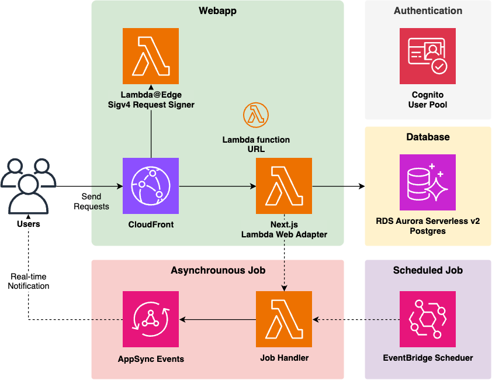

Three years ago, I wrote an article about a cost-effective AWS architecture for hobby web application development. It was a trending topic at that time.

[Building Hobby Web Services with Serverless — A Poor Man's Guide](https://tmokmss.hatenablog.com/entry/20220611/1654931458)

Recently, AWS has introduced many new services, allowing us to create architectures that are quite different from before. In this article, I'll introduce an updated cost-effective and scalable web application architecture for AWS.

## Code

The reference implementation for the architecture described in this article is published in the same repository as before.

[github.com](https://github.com/aws-samples/serverless-full-stack-webapp-starter-kit)

The main features include:

- Next.js App Router deployed on AWS Lambda
- Response streaming supported by CloudFront + Lambda function URL
- Type safety from client to server to database
- Scale-to-zero RDBMS with Aurora Serverless V2
- Asynchronous/Cron job mechanism with real-time notifications to clients
- Cognito authentication and authorization (SSR-compatible)
- One-command deployment with CDK

Let's dive deep into the architecture.

## Technology Stack Explained

Here are the key points of the architecture mentioned above.

### Next.js on Lambda

The combination of CloudFront + Lambda function URLs + Lambda Web Adapter enables Next.js to run on AWS Lambda. For more details on this configuration, please refer to the following resource:

[speakerdeck.com](https://speakerdeck.com/tmokmss/aws-lambda-web-adapterwohuo-yong-suruxin-siisabaresunoshi-zhuang-patan)

With this configuration, you can meet the [important response streaming requirements](https://nextjs.org/docs/app/building-your-application/routing/loading-ui-and-streaming) of the Next.js App Router.

An alternative advanced setup is [cdklabs/cdk-nextjs](https://github.com/cdklabs/cdk-nextjs), but I've chosen not to use it this time. I believe the current setup, leveraging CloudFront's caching capabilities, allows Next.js on Lambda to operate efficiently enough. The added complexity might not be worth the benefits.

### End-to-End Type Safety

This implementation uses the following libraries to achieve type safety from client to server to database:

- [next-safe-action](https://github.com/TheEdoRan/next-safe-action)
- [React Hook Form](https://github.com/react-hook-form/react-hook-form)
- [Prisma](https://github.com/prisma/prisma)

In the past, during the Page Router era, I created [a sample using tRPC](https://github.com/aws-samples/trpc-nextjs-ssr-prisma-lambda), but achieving end-to-end type safety has become even easier with the App Router. You can directly query the database during page rendering, and mutations are straightforward with Server Actions. While tRPC might be more convenient for client queries, Server Actions can still handle them (because they can be [executed and their results retrieved](https://next-safe-action.dev/docs/execute-actions/hooks/useaction) from client-side JavaScript).

Using raw Server Actions can make authentication and authorization processes cumbersome. To simplify these processes with middleware-like functionality, I'm using next-safe-action. You just need to [create an Action Client](https://next-safe-action.dev/docs/define-actions/create-the-client) with authentication and authorization implemented, and then use it to define Server Actions. It feels similar to [tRPC procedures](https://trpc.io/docs/server/procedures).

Another advantage of next-safe-action is its easy integration with React Hook Form. You can use the [adapter-react-hook-form](https://github.com/next-safe-action/adapter-react-hook-form) library for simple integration ([code example](<https://github.com/aws-samples/serverless-full-stack-webapp-starter-kit/blob/ae718df5303050100b161d8ab03935e78894feb0/webapp/src/app/(root)/components/CreateTodoForm.tsx#L24-L46>)).
[Conform](https://conform.guide/) is also popular for form and Server Action integration, but I prefer to maintain the familiar React Hook Form experience.

### Benefits of Serverless

Since the architecture is primarily composed of serverless services, it automatically scales out as requests increase and costs nothing during idle times. (The only exception is NAT, which I'll discuss later.)

Additionally, with the introduction of Aurora Serverless v2, it's now possible to have zero cost for your database during idle times. Previously, DynamoDB was the only AWS database that could scale to zero, but having this capability in an RDBMS is significant. The development experience with relational databases is often more familiar and smoother than with NoSQL solutions.

### Real-time Notifications to Clients with AppSync Events

[AppSync Events](https://docs.aws.amazon.com/appsync/latest/eventapi/event-api-welcome.html), which became generally available in late 2024, has made implementing real-time notifications extremely easy. This can be used, for example, to notify clients when a job is completed.

Traditionally, API Gateway WebSockets API would be used for this purpose, but AppSync Events eliminates the need to manage connection IDs and makes broadcasting implementation easier.

Personally, I often opted for polling instead of real-time notifications when using API Gateway WebSocket, as the implementation became complex. However, with AppSync Events, many of the tedious aspects are abstracted away by the service (and the [Amplify library](https://docs.amplify.aws/react/build-a-backend/data/connect-event-api/)), making it easier to implement real-time notification requirements.

There are surprisingly many use cases for this, so I encourage you to consider it.

### Integrating Next.js App Router with Cognito Login

Traditionally, when integrating Cognito login with SPAs, using the [Amplify UI components](https://ui.docs.amplify.aws/react/connected-components/authenticator) was common. However, these being client components made them less compatible with SSR, and it was challenging to store tokens in http-only cookies.

The situation has significantly improved, and there's now a library called [Amplify Next.js adapter](https://docs.amplify.aws/javascript/build-a-backend/server-side-rendering/) for effectively handling Cognito with the App Router. Rather than providing UI components, it leverages [Cognito Managed Login](https://docs.aws.amazon.com/cognito/latest/developerguide/cognito-user-pools-managed-login.html) to deliver login functionality. It also makes it easy to obtain tokens and user information on the server side via cookies.

By combining Amplify Next.js adapter with next-safe-action, you can easily protect Server Actions with Cognito authentication ([code example](https://github.com/aws-samples/serverless-full-stack-webapp-starter-kit/blob/ae718df5303050100b161d8ab03935e78894feb0/webapp/src/lib/safe-action.ts#L30-L39)).

### Cron Job Mechanism with EventBridge Scheduler

Web applications often require scheduled job execution (such as running aggregations at 4 AM daily). For this, I'm using [EventBridge Scheduler](https://docs.aws.amazon.com/scheduler/latest/UserGuide/what-is-scheduler.html).

Compared to traditional EventBridge rules, EventBridge Scheduler offers superior features such as the ability to specify cron timezones and [time windows](https://docs.aws.amazon.com/scheduler/latest/UserGuide/managing-schedule-flexible-time-windows.html).

With the [CDK L2 for Scheduler recently becoming GA](https://aws.amazon.com/blogs/devops/announcing-the-general-availability-of-the-amazon-eventbridge-scheduler-l2-construct/), schedules can be conveniently managed within CDK ([code example](https://github.com/aws-samples/serverless-full-stack-webapp-starter-kit/blob/ae718df5303050100b161d8ab03935e78894feb0/cdk/lib/constructs/async-job.ts#L55-L59)).

### One-Command Deployment with CDK

The entire system can be deployed with a single AWS CDK command. This not only simplifies initial setup but also makes environment replication easier.

One challenge in achieving this is that Next.js requires values determined at deployment time (like Cognito User Pool ID) during the build process. This means you can't build Next.js before the first deployment, which could complicate the deployment procedure.

This issue is resolved by using a construct ([`ContainerImageBuild`](https://github.com/tmokmss/deploy-time-build?tab=readme-ov-file#build-a-container-image)) that can build container images during deployment. It's an improved version of [deploy-time-build that I introduced previously](https://tmokmss.hatenablog.com/entry/20220515/1652623112).

An alternative solution would be to use the [next-runtime-env](https://github.com/expatfile/next-runtime-env) library, which injects runtime environment variables into static files. However, this approach requires special implementation ([code example](https://github.com/expatfile/next-runtime-env/blob/536fc86d486fd0da722a97264ca5bc1830e4c71e/README.md?plain=1#L56-L69)) and doesn't handle environment variables completely transparently, so I've avoided it here.

### Cost

A cost breakdown table is [summarized in the README](https://github.com/aws-samples/serverless-full-stack-webapp-starter-kit?tab=readme-ov-file#cost). The estimate is $8.50 per month for 100 users. Of course, this is a rough estimate, and actual values will depend on your use case.

A good news is that, the above does not include free tiers. If you can fully utilize the free tier, many services like Cognito, Lambda, and NAT Instance would fall within the free range, resulting in costs under $5 per month.

## Drawbacks of This Architecture

To balance the discussion, here are some known drawbacks:

### VPC Requirement Incurs NAT Gateway Costs

Even with Aurora Serverless v2, a VPC is necessary, which means you need NAT Gateway or similar functionality for Lambda network connectivity. NAT Gateway costs can be noticeable for small-scale use.

For smaller use cases, using a NAT instance instead of a NAT Gateway can reduce monthly costs to $3 (t4g.nano). You could even use an instance covered by the free tier.

Alternatively, there's [Aurora DSQL](https://aws.amazon.com/rds/aurora/dsql/), which can be used without a VPC. As of May 2025, it's still in preview, which is why I'm not using it yet, but it should be a good alternative once it becomes generally available.

### Cold Start

This architecture is affected by the cold start times of Lambda and Aurora. When accessing from an idle state, you can expect approximately the following wait times:

- Lambda: 1-3 seconds
- Aurora: About 10 seconds

This isn't a serious problem for applications with frequent access, but for applications with infrequent access (less than once every 5 minutes), there's a risk of user experience degradation due to cold starts on every access.
Unlike SPAs or static file delivery from S3, the page won't render at all until Lambda starts, which can cause anxiety for users.

Potential mitigation strategies for cold start issues include:

- Lambda: Set up a warmer to periodically (every 2 minutes, etc.) send requests to Lambda (cheaper than provisioned concurrency)
- Aurora: Adjust parameters related to auto-stopping (such as extending the time before transitioning to the stopped state)

These issues are less problematic with moderate access frequency but are worth considering.

### Cost at Scale

As web application requests increase and Lambda usage grows, cost efficiency may deteriorate. This is because Lambda isolates compute resources for each request, which can result in idle resources for I/O-bound operations (though [there are pros and cons](https://qiita.com/_kensh/items/dc99e9a0238a1b4238a5)).

As usage increases, it might become necessary to migrate to services like ECS. However, the migration itself shouldn't be too difficult, as the application can continue to use Next.js as is, and only the stateless parts need to be migrated.

The required migration work would be to replace Lambda + function URL with ALB + ECS or similar. While this would increase idle costs since it doesn't scale to zero, for large-scale usage, this cost wouldn't be a dominant factor.

## Related Information

While I've introduced my own sample implementation, AWS provides several other means of building full-stack web applications.

[Amplify Gen2](https://docs.amplify.aws/) can also be a good starting point. I personally prefer plain CDK, which is why I created the sample implementation above, but this is a matter of preference.

Recently, my Australian colleague published a tool called [NX plugin for AWS](https://github.com/awslabs/nx-plugin-for-aws). While there are implementation differences —such as using TanStack Router and tRPC, or offering Python Fast API as an option— the goal of enhancing the web application development experience is the same.

It was created by the same team as [AWS PDK](https://github.com/aws/aws-pdk), and they've applied the lessons learned from PDK. The documentation is available in various languages including Japanese or Spanish, so worth take a look: [Quick Start Guide | @aws/nx-plugin](https://awslabs.github.io/nx-plugin-for-aws/en/get_started/quick-start/)

## Conclusion

I've introduced an architecture for building full-stack web applications using the latest AWS services.

Personally, I find this configuration offers an excellent development experience, and I plan to continue using it for web application development for the foreseeable future.
