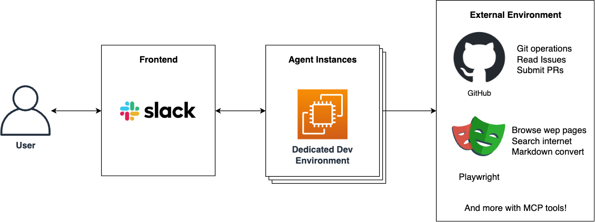
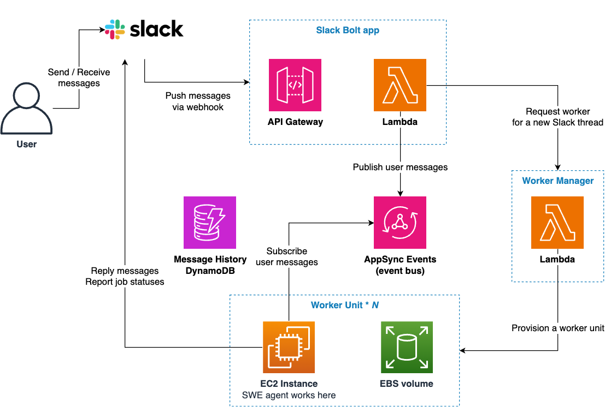
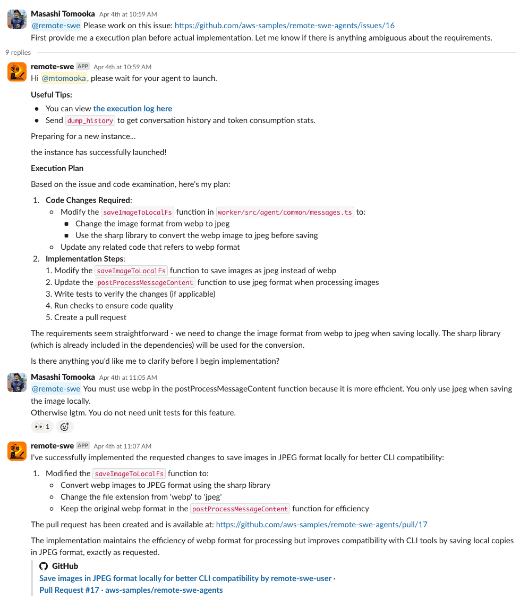

The rise of AI coding agents like OpenAI's Codex and Devin has revolutionized software development workflows. However, many of these solutions come with significant costs or don't provide the cloud-based parallel execution capabilities needed for efficient development tasks. Enter Remote SWE Agents - an open-source solution that lets you self-host autonomous software development agents on AWS.

## What is Remote SWE Agents?

Remote SWE Agents is an example implementation of fully autonomous software development AI agents that operate in their own dedicated cloud environments. Unlike many local solutions, these agents work remotely on AWS infrastructure, freeing you from being tied to your laptop while they handle development tasks.

The key differentiator is that each agent operates in its own isolated EC2 environment with persistent storage, allowing multiple agents to work in parallel on different tasks. This means you can assign several coding tasks simultaneously and monitor their progress through Slack.

## Key Features

- **Fully autonomous cloud-based development agents** that can handle complex software development tasks
- **Powered by AWS serverless services** with minimal maintenance overhead
- **No upfront or fixed costs** - pay only when you use the system
- **MCP integration** allowing agents to use various tool servers
- **Efficient token usage** through prompt caching and context management
- **Repository knowledge** from various formats (.clinerules, CLAUDE.md, etc.)
- **GitHub integration** with the ability to work on OSS forked repositories

## How does it work?

The system architecture leverages AWS services to create a reliable and scalable agent environment:

1. **Message Reception and Processing**
   - User messages in Slack are forwarded to the Slack Bolt application via webhook
   - API Gateway passes these messages to a Lambda function

2. **Event Management**
   - Lambda functions publish user messages to AppSync Events
   - Message history is stored in DynamoDB for context in subsequent processing

3. **Worker System Management**
   - When a new Slack thread is created, the Worker Manager provisions an EC2 instance and EBS volume
   - Each Worker Unit contains an SWE agent responsible for processing tasks

4. **Feedback Loop**
   - Worker Units subscribe to AppSync Events to receive user messages
   - Processing results and progress updates are sent back to Slack

This architecture provides resource isolation per agent and flexible scalability through the combination of serverless components and dedicated EC2 instances.

## Real-world Applications

Remote SWE Agents can handle a variety of software development tasks:

Common use cases include:

- Creating new features based on GitHub issues
- Implementing bug fixes across repositories
- Updating dependencies and resolving conflicts
- Creating documentation from code
- Processing and responding to pull request reviews

The agents can create pull requests autonomously, allowing you to simply review and merge when they complete their work.

## Cost Efficiency

One of the major advantages of Remote SWE Agents is its cost efficiency. Since it's built on AWS serverless architecture, you only pay for what you use:

- Zero ongoing costs when not in use
- No upfront payment required
- Approximately $1-2 per agent session (typically)

For comparison, a sample cost estimate for 100 sessions per month using the Claude Sonnet 3.7 model is around $120 total. The system uses prompt caching to minimize token usage, reducing costs by 60-80% compared to uncached solutions.

## Getting Started

Setting up Remote SWE Agents in your AWS account is straightforward:

1. Clone the repository and set up required parameters
2. Deploy the CDK stack
3. Configure a Slack app for agent interaction
4. Set up GitHub integration through Personal Access Token or GitHub App
5. Deploy again with your configuration

For detailed instructions, visit the [GitHub repository](https://github.com/aws-samples/remote-swe-agents).

## How to Use It Effectively

When starting an agent, your instruction should include:

1. Which GitHub repository they should work with
2. A clear description of the feature or bug to be addressed
3. Initial file paths to check

For simplicity, you can create a GitHub issue with this information and just give the agent its URL. The repository will be automatically inferred, and the new PR can be linked to the corresponding issue.

## Conclusion

Remote SWE Agents brings the power of AI coding assistants like Devin or Codex to your AWS account with the flexibility of cloud-based execution and parallel processing. By working remotely in dedicated environments, these agents can handle multiple coding tasks simultaneously while you monitor their progress from anywhere.

As foundation models continue to improve, the capabilities of these agents will only increase. Try it today and experience how these autonomous agents can enhance your development workflow!