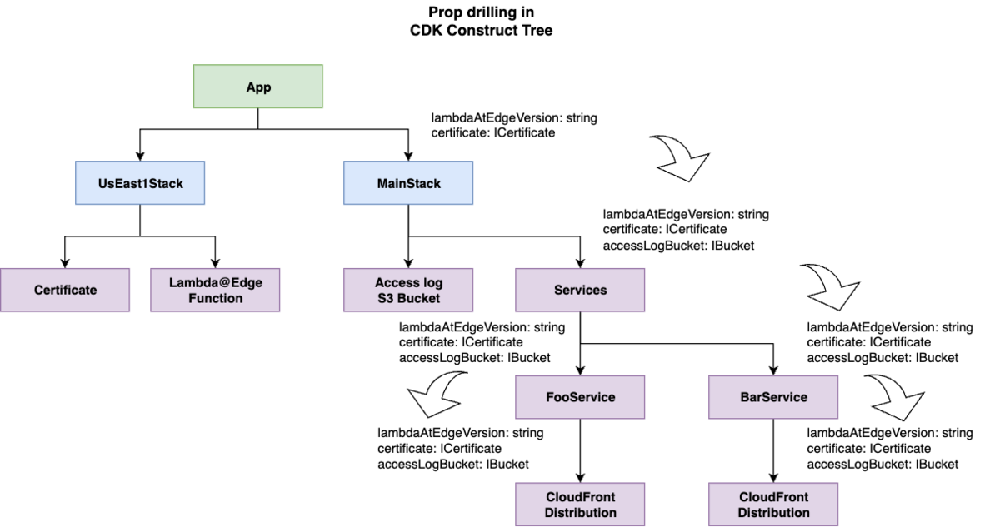
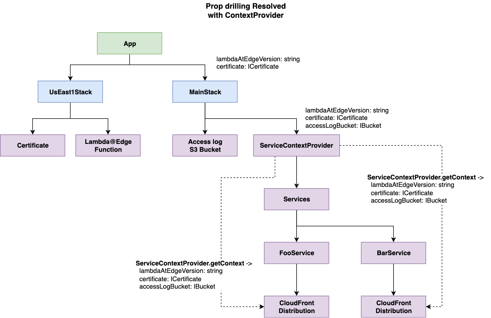

This is part of the [AWS CDK Tips series](https://tmokmss.hatenablog.com/entry/aws_cdk_tips).

## Motivation

In an old article, I recommended structuring CDK stacks with constructs.

[tmokmss.hatenablog.com](https://tmokmss.hatenablog.com/entry/20221212/1670804620)

When taking this approach, passing properties from parent layers to deeply nested child constructs can become cumbersome. This is commonly known as **props bucket relay** or [**prop drilling**](https://react.dev/learn/passing-data-deeply-with-context).



A typical prop drilling scenario

To pass properties, you need interface definitions and property-passing code at each level, propagating them through parent-child-grandchild relationships, which can be quite tedious.

This article proposes a method to avoid such inconvenience. Note that this is not a widely adopted approach, so I recommend discussing it with your team from a readability perspective before implementation.

## Proposed Method

Let me first show the concept with a code example:

```typescript
interface ApiServiceContext {
  logBucket: Bucket;
  environment: string;
}

export class ApiServiceContextProvider extends Construct {
  private static contextKey = "apiService:context";

  constructor(scope: Construct, id: string, props: ApiServiceContext) {
    super(scope, id);
    this.node.setContext(ApiServiceContextProvider.contextKey, props);
  }

  static getContext(scope: Construct): ApiServiceContext {
    const context = scope.node.tryGetContext(this.contextKey);
    if (!context) {
      throw new Error("ApiServiceContextProvider is missing.");
    }
    return context;
  }
}

export class ApiService extends Construct {
  constructor(scope: Construct, id: string, props: { apiName: string }) {
    super(scope, id);

    // Get context without going through props
    const { logBucket, environment } =
      ApiServiceContextProvider.getContext(this);

    // Implementation continues...
  }
}
```

This is an example when defining a custom construct called `ApiService`. You can see that the required variables (`logBucket`, `environment`) are retrieved through `ApiServiceContextProvider` without going through `props`.

The code using this construct would look like:

```typescript
export class MyStack extends Stack {
  constructor(scope: Construct, id: string, props?: StackProps) {
    super(scope, id, props);

    const logBucket = new Bucket(this, 'LogBucket');

    // Create context provider
    let context = new ApiServiceContextProvider(this, 'Default', {
      environment: 'production',
      logBucket,
    });

    // Use context as scope for child constructs
    new ApiService(context, 'UserApi', { apiName: 'user' });

    // Multiple constructs can use the same context
    new ApiService(context, 'OrderApi', { apiName: 'order' });

    // Even nested constructs can access the context
    const child = new SomeConstruct(context, 'Child', {...});
    new ApiService(child, 'Api', { apiName: 'grand-child' });

    // You can nest multiple context providers
    context = new DatabaseContextProvider(context, 'Default', {...});
    new Database(context, 'UserDB', {...});
  }
}
```

Here's a [practical project implementation example](https://github.com/aws-samples/serverless-full-stack-webapp-starter-kit/blob/4fb9e971d4729b364ad08a7923c90e4b5d19b102/cdk/lib/main-stack.ts#L72-L86).

### Key Points

The key points of this method are:

#### 1. React-like ContextProvider Pattern

Instead of passing props, we introduce a new concept called ContextProvider. This is inspired by React's [Context API](https://react.dev/learn/passing-data-deeply-with-context), and since CDK already has the [concept of context](https://docs.aws.amazon.com/cdk/v2/guide/context.html), it fits surprisingly well. ContextProvider allows passing properties to descendants in the construct tree without using props.

#### 2. Implicit Convention and Error Messages

When using ApiService, you must also define ApiServiceContextProvider. This is an implicit convention, but users can easily notice it through synthesis-time error messages (ApiServiceContextProvider is missing.). This is the same experience as using useContext outside a Provider in React.

#### 3. No Impact on Logical IDs

By setting `id=Default` when creating ContextProvider, it doesn't affect CloudFormation logical IDs. This is because the id "Default" is ignored during logical ID calculation ([reference](https://tmokmss.hatenablog.com/entry/aws_cdk_tips_id_default)). When multiple types of ContextProviders are required, you nest the necessary ContextProviders. Even then, you can set all of them to `id=Default`, so there's no impact on logical IDs.

### Benefits

Did the overview get through to you? Now let me explain the benefits of this method.

#### 1. Eliminating Prop Drilling

The biggest advantage is being able to pass properties directly to deeply nested child constructs without going through intermediate layers. This eliminates the need for intermediate layer Props interface definitions and passing code, improving code clarity.

#### 2. Type Safety

ContextProvider can be used in a type-safe manner, reducing the risk of users passing incorrect context. Also, if you want to reference context from other constructs, you can use the static `getContext` method to retrieve context in a type-safe way.

#### 3. Improved Construct Independence

When passing through Props, interface definitions can be cumbersome, often leading to implementations that pass StackProps directly. This makes individual constructs dependent on the Stack side, often reducing reusability across projects.

ContextProvider is expected to be provided by each construct library individually. This allows individual constructs to request only the information they need, maintaining construct independence and improving reusability and testability.

Of course, passing through Props is sometimes more convenient, so you'll need to judge appropriately whether to receive through ContextProvider or Props. In practice, implementations that pass StackProps directly don't cause problems very often.

#### 4. Scope Control

The context scope is limited to the children of the ContextProvider. Also, creating the same ContextProvider in a child of the ContextProvider can overwrite the context. Understanding these specifications allows you to flexibly pass values even when you have different child constructs that require different contexts.

#### 5. Multi-language Support

Since this mechanism doesn't violate [jsii conventions](https://aws.github.io/jsii/specification/4-standard-compliance-suite/), it can be used in multi-language construct libraries.

---

Rewriting the original prop drilling example diagram, it looks like this. The prop passing is reduced and looks cleaner.



Eliminating Prop Drilling with ContextProvider

### Drawbacks

Let's also consider the drawbacks.

The first is readability and cognitive load. Creating a ContextProvider construct and using it as a scope to create other constructs is not a very familiar implementation pattern.

```typescript
let context = new ApiServiceContextProvider(this, "Default", {
  environment: "production",
  logBucket,
});

// Using context as scope
new ApiService(context, "UserApi", { apiName: "user" });
```

In React (JSX) notation, it would look like the following, but in CDK notation, it becomes a bit complicated. I think this is a problem that can be solved with familiarity.

```jsx
<Stack>
  <ApiService />
</Stack>

// becomes

<Stack>
  <ApiServiceContextProvider>
    <ApiService />
  </ApiServiceContextProvider>
</Stack>
```

The second issue is using `id=Default`. Default can only be used once per scope, so it's inconvenient when creating multiple ContextProviders within the same scope.

```typescript
const context = new ApiServiceContextProvider(this, "Default", {
  environment: "production",
  logBucket,
});

// This would cause an ID conflict
const context2 = new ApiServiceContextProvider(this, "Default", {
  environment: "production",
  logBucket: anotherLogBucket,
});
```

Since we're using `id=Default` solely to avoid affecting logical IDs, if you can compromise on that point, other strings work fine too. Using any short string would also be effective. Also, to avoid this situation, it's important to ensure that properties passed through ContextProvider are limited to those that don't vary much between constructs.

The third drawback is that you need to write ContextProvider definition code for each construct. While it can be written mechanically, it's somewhat tedious. This could potentially be shared in a type-safe way if Generics were available, but under jsii constraints, it seems you can only define them statically. Since it's about 15 lines of code, I think this amount is acceptable.

```typescript
export class FooContextProvider extends Construct {
  private static contextKey = "foo:context";

  constructor(scope: Construct, id: string, props: FooServiceContext) {
    super(scope, id);
    this.node.setContext(FooContextProvider.contextKey, props);
  }

  static getContext(scope: Construct): FooServiceContext {
    const context = scope.node.tryGetContext(this.contextKey);
    if (!context) {
      throw new Error("FooContextProvider is missing.");
    }
    return context;
  }
}
```

---

While using this approach may reveal other drawbacks over time, I haven't found any fatal flaws so far. If you find prop drilling cumbersome, please give this approach a try.

## Conclusion

I made this post a year ago, but finally came up with a decent idea.

> AWS CDK also often has cumbersome props bucket relay to nested constructs, so it would be nice to have an API equivalent to React's useContext  
> Since context already exists, I'd like to wrap it with a more type-safe API https://t.co/mlc9z42NT4
>
> — Masashi Tomooka (@tmokmss) [October 14, 2024](https://twitter.com/tmokmss/status/1845664527679156615?ref_src=twsrc%5Etfw)

How do you think? Please share your opinions!
