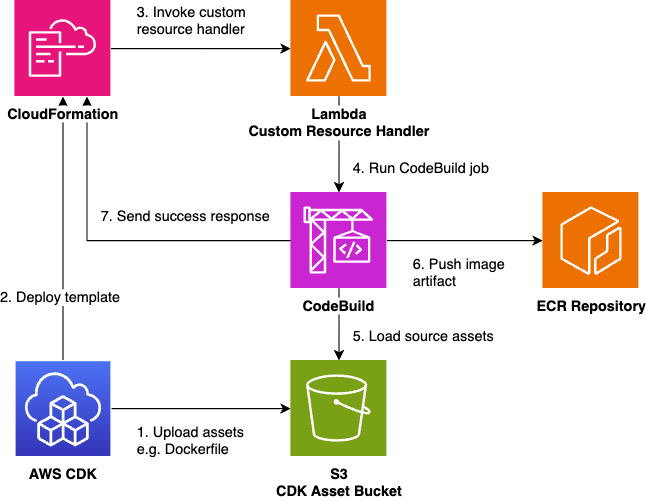

CDK has a convenient mechanism for building and deploying containers during CLI execution. However, since this container image building occurs in the CLI execution environment (locally), there can be inconveniences:

- Unable to build due to different CPU architectures (x86 or arm)[^1]
- Container building requires significant computational resources and is slow
- Large image sizes make image pull/push operations slow
- Want to embed information from other AWS resources (CDK tokens) into buildArgs

This article introduces the `ContainerImageBuild` construct from the deploy-time-build construct library to solve the above problems.

https://github.com/tmokmss/deploy-time-build

## How to Use

A picture is worth a thousand words, so let me first show you how to use it.

### Simply Replace Existing DockerImageAsset

If you're currently using [`DockerImageAsset`](https://docs.aws.amazon.com/cdk/api/v2/docs/aws-cdk-lib.aws_ecr_assets.DockerImageAsset.html) in your code, you can replace it as a drop-in replacement by just changing the class name.

```typescript
const asset = new DockerImageAsset(this, "MyBuildImage", {
  directory: path.join(__dirname, "my-image"),
  buildArgs: {
    HTTP_PROXY: "http://10.20.30.2:1234",
  },
});
// ↓ becomes
const image = new ContainerImageBuild(this, "MyBuildImage", {
  directory: path.join(__dirname, "my-image"),
  buildArgs: {
    HTTP_PROXY: "http://10.20.30.2:1234",
  },
});
```

With just this change, images that were previously built locally will now be built and pushed during deployment.
Since it implements the same properties as `DockerImageAsset` such as `imageUri`, `imageTag`, and `repository`, it can be used as almost a complete drop-in replacement.

Furthermore, by specifying Platform, you can switch between Arm/X86 regardless of your local environment, and you can also pass references to other resources (tokens) in buildArgs.

```typescript
const userPool = new cognito.UserPool(...);
const image = new ContainerImageBuild(this, 'MyBuildImage', {
  directory: path.join(__dirname, 'my-image'),
  buildArgs: {
    USER_POOL_ID: userPool.userPoolId,
  },
  platform: Platform.LINUX_ARM64,
});
```

### Using Container Images with Lambda

When using with Lambda's [DockerImageFunction construct](https://docs.aws.amazon.com/cdk/api/v2/docs/aws-cdk-lib.aws_lambda.DockerImageFunction.html), you can easily use it with the `toLambdaDockerImageCode` function.

```typescript
import { ContainerImageBuild } from "deploy-time-build";

const image = new ContainerImageBuild(this, "Image", {
  directory: "example-image",
});
new DockerImageFunction(this, "Function", {
  code: image.toLambdaDockerImageCode(),
});
```

### Using Container Images with ECS

Similarly, when using with ECS, the `toEcsDockerImageCode` function makes it easy.

```typescript
const image = new ContainerImageBuild(this, "Image", {
  directory: "example-image",
});
new FargateTaskDefinition(this, "TaskDefinition", {}).addContainer("main", {
  image: image.toEcsDockerImageCode(),
});
```

### Using Container Images with Other Constructs

Other than ECS/Lambda, there are other AWS services that use container images. In those cases, you can use properties like `image.imageUri`.
However, note that in this case, you need to explicitly grant read permissions to the repository for the consuming side.

```typescript
const image = new ContainerImageBuild(this, "Image", {
  directory: "example-image",
  platform: Platform.LINUX_ARM64,
});

new CfnResource(this, "AgentRuntime", {
  type: "AWS::BedrockAgentCore::Runtime",
  properties: {
    RoleArn: runtimeRole.roleArn,
    AgentRuntimeArtifact: {
      ContainerConfiguration: {
        ContainerUri: image.imageUri,
      },
    },
  },
});

image.repository.grantPull(runtimeRole);
```

## How It Works

`ContainerImageBuild` works using the mechanism shown in the diagram below. It encapusulates a frequent implementation pattern that triggers CodeBuild during CFn deployment as a CDK construct with a nice API.



## Other Features

`ContainerImageBuild` has several other features:

- Specify destination ECR repository (repository property)
- Specify image tag and tag prefix when pushing (tag, tagPrefix properties)
- Enable zstd compression for images ([reference](https://aws.amazon.com/blogs/containers/reducing-aws-fargate-startup-times-with-zstd-compressed-container-images/))

Compared to regular DockerImageAsset, it aims to be functionally superior, so I believe there are many convenient aspects to using it.

## Disadvantages

Let me also mention the drawbacks of `ContainerImageBuild`. The biggest disadvantage is that CDK deployments can become slower in some cases.

In local environments, Docker's layer cache is available, so when cache can be properly utilized, second and subsequent deployments are relatively fast.

On the other hand, with `ContainerImageBuild`, due to CodeBuild's nature, the cache often evaporates with each build execution, requiring time equivalent to a full build each time. Therefore, it may not be suitable for cases where you frequently deploy while changing code, such as during development verification.

This problem can be improved by using the CodeBuild Docker Server feature that went GA in May 2025. `ContainerImageBuild` doesn't yet support this as an official API, but there's a workaround using escape hatches [documented here](https://github.com/tmokmss/deploy-time-build/issues/41#issuecomment-3305037617). However, please note that as of October 2025, Arm builds are not yet supported, so it cannot be used in all cases.

[Accelerate CI/CD pipelines with the new AWS CodeBuild Docker Server capability | AWS News Blog](https://aws.amazon.com/jp/blogs/aws/accelerate-ci-cd-pipelines-with-the-new-aws-codebuild-docker-server-capability/)

Since container images can often be run locally as well, I also recommend doing fast iterations locally.

## Summary

With the GA of AgentCore Runtime and other developments, I felt there was increased demand for cross-platform building, so I compiled this into an article.

I've been dogfooding `ContainerImageBuild` myself in the development of several assets ([example 1](https://github.com/aws-samples/remote-swe-agents/blob/10242ba22566f343c173bc7de25b9845d043064f/cdk/lib/constructs/webapp.ts#L59-L78), [example 2](https://github.com/aws-samples/sample-serverless-nova-sonic-chat/blob/e09f34f279def0d404075ac3e62a1f64be9a6b44/cdk/lib/constructs/service.ts#L36-L52)) and it has been running stably without any particular issues.

I think there are many situations where using it can make things easier, so please give it a try!

[^1]: This can usually be [solved with QEMU](https://docs.docker.com/build/building/multi-platform/#qemu), but introduction can be difficult in some cases.
