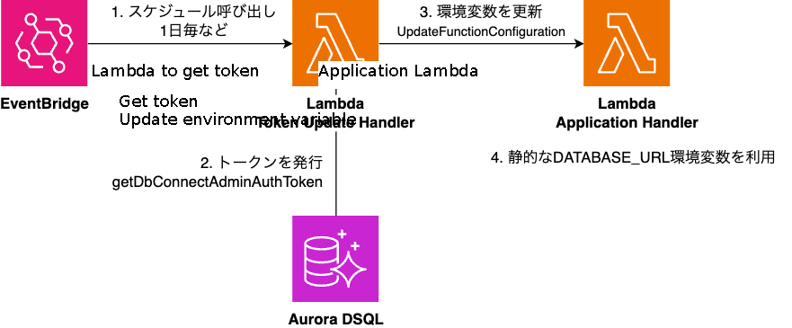
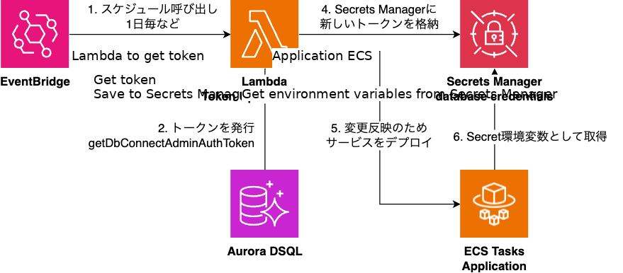

This article discusses how to use [Aurora DSQL](https://aws.amazon.com/blogs/aws/introducing-amazon-aurora-dsql/), the next-generation serverless RDB, with [Prisma](https://www.prisma.io/), an ORM for TypeScript. I want to start using DSQL more!

First, can the current version of Prisma handle DSQL?

Fortunately, DSQL [achieves PostgreSQL compatibility](https://docs.aws.amazon.com/aurora-dsql/latest/userguide/working-with-postgresql-compatibility.html) in many aspects, so you can connect to it from Prisma as a PostgreSQL database. Just set `datasource.provider` to `postgresql` in your `schema.prisma`:

```
datasource db {
  provider = "postgresql"
  url      = env("DATABASE_URL")
}
```

I added a simple model and confirmed that migrations and data read/write operations work properly:

```
model User {
  id String @id
}
```

However, there was one consideration: **how to pass the environment variable `DATABASE_URL`?** This article will mainly focus on this point.

## The Challenge with DSQL and Environment Variable `DATABASE_URL`

In DSQL, you use an [authentication token](https://docs.aws.amazon.com/aurora-dsql/latest/userguide/SECTION_authentication-token.html) (referred to as "token" below) as the password string for database connections, which is designed to be dynamically generated. Here is an example of dynamically obtaining a token and generating a database URL:

```
import { DsqlSigner } from '@aws-sdk/dsql-signer';

const hostname = 'example.dsql.us-east-1.on.aws';
const signer = new DsqlSigner({
  hostname,
  expiresIn: 24 * 3600 * 7,
});
const token = await signer.getDbConnectAdminAuthToken();
const url = `postgres://admin:${encodeURIComponent(token)}@${hostname}:5432/postgres`;
```

On the other hand, Prisma (implicitly) assumes that the password string is passed as a static environment variable. Reference: [Connection URLs](https://www.prisma.io/docs/orm/reference/connection-urls)

This discrepancy could potentially worsen the DSQL x Prisma user experience. Let's look at how you can implement this properly.

## Implementation Examples

Here are some implementation ideas I've considered or found.

### Implementation 1: Dynamically Generate PrismaClient

This method initializes PrismaClient after dynamically setting the environment variable `DATABASE_URL`:

```
import { DsqlSigner } from '@aws-sdk/dsql-signer';
import { PrismaClient } from '@prisma/client';

const hostname = 'example.dsql.us-east-1.on.aws';

async function generateToken() {
  const signer = new DsqlSigner({
    hostname,
  });
  return await signer.getDbConnectAdminAuthToken();
}

export const getClient = async () => {
  const token = await generateToken();
  process.env.DATABASE_URL = `postgres://admin:${encodeURIComponent(token)}@${hostname}:5432/postgres`;

  return new PrismaClient();
};


import { getClient } from './prisma';

const main = async () => {
  const prisma = await getClient();
  await prisma.user.findMany();
}
```

I think this is the most straightforward approach. The drawbacks compared to conventional usage are:

1. You need to get PrismaClient through an asynchronous function
   - If using static environment variables, you could simply get it as a variable, so the usability changes somewhat
   - Example: `await prisma.user.findMany` → `await (await getClient()).user.findMany`, etc.
2. You need to handle reconnections
   - When the token expires, you won't be able to establish new connections to the database (existing connections seem to remain usable)
   - Therefore, you need to reinitialize PrismaClient before the token expires
   - Note that you can specify a token expiration up to one week, so this might not be a concern in relatively short-lived runtimes like AWS Lambda

For reference, here's code that handles reconnections (only the `getClient` function is shown):

```
let client: PrismaClient | undefined = undefined;
let lastEstablieshedAt = 0;
export const getClient = async () => {
  if (client) {

    if (Date.now() - lastEstablieshedAt < 1 * 3600 * 1000) {
      return client;
    } else {
      await client.$disconnect();
    }
  }
  lastEstablieshedAt = Date.now();
  const token = await generateToken();
  process.env.DATABASE_URL = `postgres://admin:${encodeURIComponent(token)}@${hostname}:5432/postgres`;
  client = new PrismaClient();
  return client;
};
```

By the way, if you can use top-level await, you can export the PrismaClient itself, making it a bit more user-friendly. However, implementing reconnections might become more challenging.

```
const getClient = async () => {

  return new PrismaClient();
};


import { prisma } from './prisma.mts';
export const prisma = await getClient();
```

### Implementation 2: Embed Authentication Token as Environment Variable

The second approach is to treat the dynamic token as a static one. This could be achieved by creating a mechanism like the following (not implemented):

Create a Lambda that retrieves tokens and overwrites the environment variables of the main application (also assumed to be running on Lambda).
Call this Lambda periodically before the token expires.



For applications on ECS, since you can [dynamically embed environment variables from Secrets Manager](https://docs.aws.amazon.com/AmazonECS/latest/developerguide/secrets-envvar-secrets-manager.html), a configuration like the following might work (without directly updating task definitions):



The advantage of this approach is that, from Prisma's perspective, the database URL string is a static string obtained from an environment variable, so the experience is exactly the same as conventional usage.

However, potential disadvantages include:

- Some organizations may not recommend writing authentication information directly into Lambda environment variables
  - Reference: [Securing Lambda environment variables](https://docs.aws.amazon.com/lambda/latest/dg/configuration-envvars-encryption.html)
- Cold starts occur every time the token is updated
  - But since this would only happen every few hours, the impact may not be significant
- The implementation and management of the token update mechanism are required
  - It's similar to authentication information rotation mechanisms; once created, it's almost maintenance-free, but there is some initial hassle
  - Reusable modules like CDK constructs would be helpful

Nevertheless, the simplicity of the application-side implementation is certainly appealing.

### Implementation 3: Replace Prisma's DB Driver with `node-postgres`

In Prisma for PostgreSQL, you can [replace the DB driver with node-postgres (pg)](https://www.prisma.io/docs/orm/overview/databases/postgresql#using-the-node-postgres-driver) instead of using Prisma's built-in driver. With node-postgres, you can specify an async function as the password, allowing for a straightforward implementation:

```
generator client {
  provider = "prisma-client-js"

  previewFeatures = ["driverAdapters"]
}


import { PrismaPg } from '@prisma/adapter-pg';
import { PrismaClient } from '@prisma/client';
import { Pool } from 'pg';
import { DsqlSigner } from '@aws-sdk/dsql-signer';

const hostname = 'example.dsql.us-east-1.on.aws';

const pool = new Pool({
  host: hostname,
  user: 'admin',
  database: 'postgres',
  port: 5432,
  ssl: true,
  password: async () => {
    const signer = new DsqlSigner({
      hostname,
    });
    return await signer.getDbConnectAdminAuthToken();
  },
});
const adapter = new PrismaPg(pool);
const prisma = new PrismaClient({ adapter });
const users = await prisma.user.findMany();
```

Personally, I think this approach is the simplest and most elegant. Since the password function is called for each new connection, the expiration issue is naturally resolved.

One thing to note is that since the DB driver itself is replaced, there could be impacts on Prisma's behavior. I haven't personally used Prisma with node-postgres, so I'm not sure how much difference there might be in behavior. Since it's still a preview feature, there might be some lingering concerns.

## Actually, This Has Been a Universal Problem Before DSQL

Upon reflection, this issue is not unique to DSQL.

Developers have likely faced the same problem in scenarios such as:

- Connecting using [IAM authentication for RDS](https://docs.aws.amazon.com/AmazonRDS/latest/UserGuide/UsingWithRDS.IAMDBAuth.Connecting.html)
- Retrieving DB credentials from external stores instead of environment variables
- Rotating DB credentials in Secrets Manager or similar services

This problem has been reported in Prisma for over three years, but it seems it hasn't been resolved yet:

- [Dynamic Connection Settings #7869](https://github.com/prisma/prisma/issues/7869)
- [Support for AWS Secrets Manager or Azure KeyVault in schema.prisma #7534](https://github.com/prisma/prisma/issues/7534)

One Prisma-specific challenge [mentioned](https://github.com/prisma/prisma/issues/7869#issuecomment-982418375) is that since the query engine is written in Rust, it's difficult to execute async functions written in JavaScript to retrieve passwords. Recently, there's been [talk of migrating Prisma's Rust components to TypeScript](https://www.prisma.io/blog/prisma-orm-manifesto#4-enabling-community-extension-and-collaboration) (in a completely different context), so there might be some hope there.

> We're addressing this by migrating Prisma's core logic from Rust to TypeScript and redesigning the ORM to make customization and extension easier.

## Conclusion

I've considered how to handle authentication tokens when using Aurora DSQL with Prisma. While there are some Prisma-specific challenges, once you establish the connection, you can use it normally. I look forward to utilizing it as a serverless PostgreSQL option in the future.

The code used for verification is available here: [aurora-dsql-prisma-example](https://github.com/tmokmss/aurora-dsql-prisma-example)

## Mona's Monthly Update

Here she is, finding her old place of comfort under the display amid the interior changes from moving.


See you next time!
